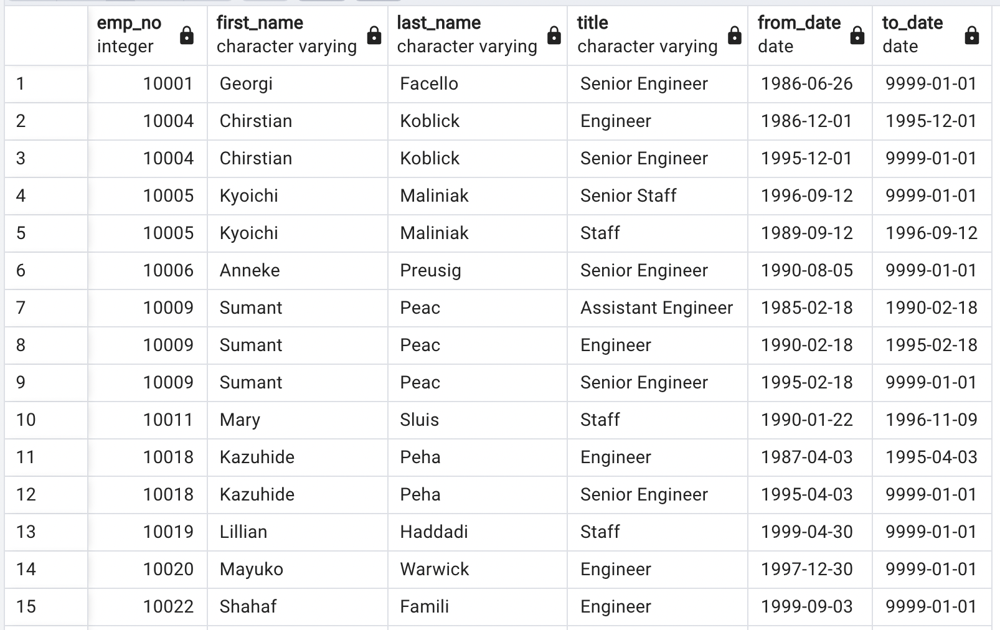

# Pewlett-Hackard-Analysis

## Overview 

***Background***
With Pewlett Hackard being a large company with several thousand employees, many are going to start retiring. In order to keep their company afloat, we need to perfom employee research to find out: 
  - Who will be retiring in a few years?
  - How many positions will need to be filled? 
  - How many employees are eligible for a retirement package?

With only six csv files to work from, we need to help the Human Resources Analyst use SQL to find the answers to these questions to help "future-proof" Pewlett Hackard's company. 

***Purpose***
The purpose of this analysis is to determine the number of retiring employees per title and identify employees who are eligible to participate in a mentorship program. 

## Resources 
- Data Source: Original data (departments.csv, dept_emp.csv, dept_manager.csv, employees.csv, salaries.csv, titles.csv
- Software: PostgreSQL 13.8 and pgAdmin 13.8 

## Results
After looking through the six data source csvs, identifying data relationships and determining entity relationships, an ERD (Entity Relationship Diagram) was created using Quick DBD (quickdatabasediagrams.com). 

## Summary 
