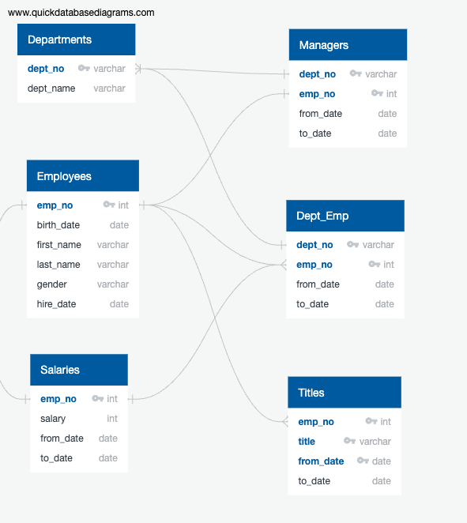
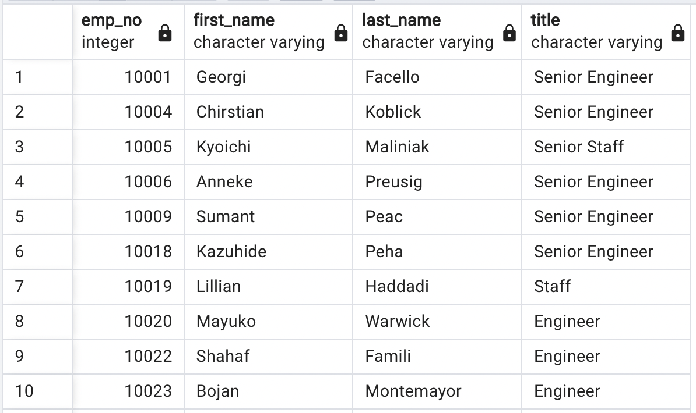
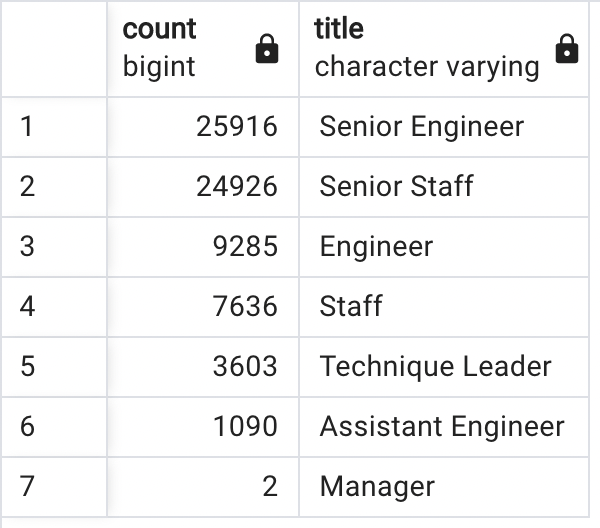
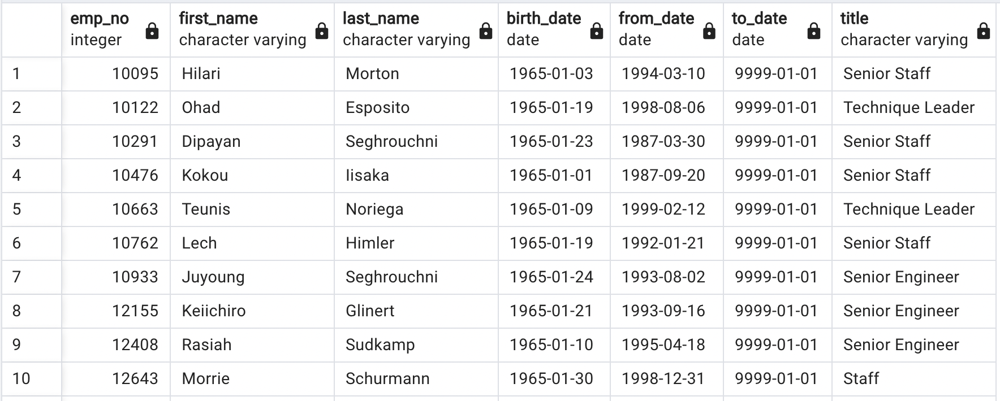

# Pewlett-Hackard-Analysis

## Overview 

***Background***
With Pewlett Hackard being a large company with several thousand employees, many are going to start retiring. In order to keep their company afloat, we need to perfom employee research to find out: 
  - Who will be retiring in a few years?
  - How many positions will need to be filled? 
  - How many employees are eligible for a retirement package?

With only six csv files to work from, we need to help the Human Resources Analyst use SQL to find the answers to these questions to help "future-proof" Pewlett Hackard's company. 

***Purpose***
The purpose of this analysis is to determine the number of retiring employees per title and identify employees who are eligible to participate in a mentorship program. 

## Resources 
- Data Source: Original data (departments.csv, dept_emp.csv, dept_manager.csv, employees.csv, salaries.csv, titles.csv
- Software: PostgreSQL 13.8 and pgAdmin 13.8 


## Results
### Process for Obtaining Results 
After looking through the six data source csvs, identifying data relationships and determining entity relationships, an ERD (Entity Relationship Diagram) was created using [Quick DBD](https://www.quickdatabasediagrams.com/). From this ERD, we were able to create a database, tables, and import our data in our software (PostgreSQL and pgADmin). 



After our initial exploratory analysis, we first created a table listing all the employees who were eligible to retire. However, our first table [retirement_titles](https://github.com/meghanhkoon/Pewlett-Hackard-Analysis/blob/main/Data/retirement_titles.csv) had duplicate entries for some employees because they may have switched titles/ job positions over the years. To remove these duplicates, we had to use the DISTINCT ON statement when selecting our rows. We also have to remove employees that have already left the company. See the code for our query below. 
```
-- Retirement Titles Table
SELECT e.emp_no,
e.first_name,
e.last_name,
t.title,
t.from_date,
t.to_date
INTO retirement_titles
FROM employees as e
	INNER JOIN titles as t
		ON (e.emp_no = t.emp_no)
WHERE (e.birth_date BETWEEN '1952-01-01' AND '1955-12-31')
ORDER BY emp_no ASC;
-- Check retirement_titles table
SELECT * FROM retirement titles;

-- Use Dictinct with Orderby to remove duplicate rows
SELECT DISTINCT ON (rt.emp_no) rt.emp_no,
rt.first_name,
rt.last_name,
rt.title
INTO unique_titles
FROM retirement_titles as rt
WHERE (rt.to_date = '9999-01-01')
ORDER BY emp_no, to_date DESC;
-- Check unique_titles table
SELECT * FROM unique_titles;
```

### Final Table Results 
* A total of 72,458 employees are eligible for retirement this year. This table demonstrates what our data in our [unique_titles.csv](https://github.com/meghanhkoon/Pewlett-Hackard-Analysis/blob/main/Data/unique_titles.csv) looks like. 



After removing our duplicates and those who already left the company, we created a table with all the employees eligible for retirement. We then creating our retirement_titles.csv, we used the COUNT() and GROUPBY() functions to show the number of retirement-age employees by most recent job title. 

* Out of the 72,458 eligible retiring employees, there are 25,916 Senior Engineers, 24,926 Senior Staff, 9,285 Engineers, 7636 Staff, 3,603 Technique Leaders, 1,090 Assistant Engineers, and 2 Managers. This data is helpful for knowing how many of which positions will need to be filled. See the table below.
* An alarming 70% of employees of retirement age (50,842 out of the total 72,458) hold Senior titles (Senior Engineer / Senior Staff). 



Lastly, we found a list of employees who were eligibily for a mentorship program by finding current employees who were born between January 1, 1965 and Dec. 31, 1965. 

* There were a total of 1549 eligible employees for the mentorship program. For the full list of employees who are eligible for mentorship, see [mentorship_eligibility](https://github.com/meghanhkoon/Pewlett-Hackard-Analysis/blob/main/Data/mentorship_eligibility.csv).



## Summary 

